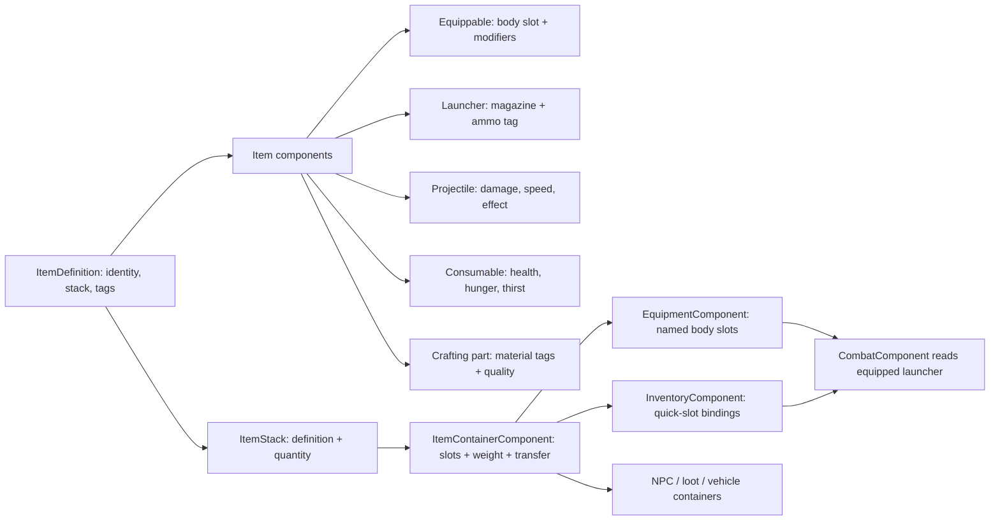

# City Survival: Item, Equipment, and Inventory GDD

## High concept

The portal experiment at the city research campus opened a breach into a
Cthulhu Mythos-adjacent reality. Survivors fight in a modern city with police
surplus, construction gear, improvised tools, and unstable matter brought
through the breach. The item game is about deciding what to carry, what to
wear, and which broken parts are worth combining before the next expedition.

## Design pillars

1. **Every useful thing is an item.** A pistol, a 9 mm round, an apple, and a
   phase battery use one item definition and gain behaviour through components.
2. **Equipment is anatomical.** The player has head, face, torso, legs, feet,
   two hands, backpack, and two accessory slots. An item decides where it fits;
   the equipment container never hard-codes a particular vest or weapon.
3. **Carry choices create survival stories.** The backpack has slots and a
   weight limit. Armor protects, while a backpack increases capacity.
4. **Salvage becomes invention.** Parts have tags and quality rather than a
   unique recipe dependency. Future recipes can ask for `metal + receiver +
   electronics`, allowing multiple valid solutions.

## Architecture

`ItemDefinition` is immutable content data. `ItemStack` stores mutable runtime
quantity. `ItemContainerComponent` owns the common slot, weight, merge, split,
and atomic transfer rules. `InventoryComponent` derives from it for player/NPC
backpacks and adds quick-slot bindings; `EquipmentComponent` derives from it for
the same physical-item semantics while constraining slots to anatomy. This keeps
save/load, trading, loot containers, and network sync straightforward: save an
item id plus quantity, then rebuild the definition from the catalog.

## Implemented components

| Component | What it supplies | Example |
| --- | --- | --- |
| Equippable | Named body slot and passive modifiers | vest → torso, hard hat → head |
| Launcher | Weapon configuration ID | pistol resolves `service_pistol` from the weapon table |
| Projectile | Damage, trajectory, range, impact effect | bullets, bolts, flares, thrown apple |
| Endurance | Capacity, drain, refill tag, depletion result | flashlight battery and burning torch |
| Light Emitter | Point/spot shape, color, range, energy and flicker | flashlight, torch, emergency flare |
| World Actor | Persistent behavior after leaving a container | a thrown flare keeps burning on the ground |
| Aim | Strategy plus range and presentation tuning | direct pistol aim, lobbed stone, future charged bow |
| Consumable | Immediate health/hunger/thirst effects | medkit, beans, water, apple |
| CraftingPart | Material tags and quality | gun receiver, void resin, phase battery |
| HumanoidProfile | HP index, stamina, social traits, relationship map | survivor and Safehouse Quartermaster |

An apple demonstrates composition: it has both `Consumable` and `Projectile`.
Using it restores a little hunger; throwing it creates a zero-damage projectile
with a noise effect. The current combat projectile is shared presentation for
these effects. Smoke, ward, lure, and noise resolution are the next gameplay
layer to add.

## Equipment and inventory rules

The current player has 24 backpack slots, a 32 kg carrying limit, and these
equipment slots: head, face, torso, legs, feet, left hand, right hand, backpack,
accessory 1, and accessory 2. Equipping moves the actual stack from backpack to
the body slot. Unequipping returns it only if the backpack can hold it.

The game starts with a service pistol in the right hand. Its `LauncherComponent`
loads 9 mm rounds from the backpack. Firing drains its magazine; reloading takes
rounds from matching stacks. With no compatible ammo, the weapon cannot reload.

Press **I** in-game to open the backpack. The screen presents every backpack
slot in a grid, ten body slots, weights, item tooltips, and mouse interaction.
Drag between backpack slots to swap, drag compatible gear onto its body slot to
equip, drag gear back to an empty backpack slot to unequip, and drag a backpack
item onto the persistent quickbar to bind it. Shift-click splits a stack; left
click uses or equips; right-click throws an item with `ProjectileComponent`.

Equipped left-hand, right-hand, and two-hand items with a lob `AimComponent` and
a `ProjectileComponent` support aimed world throws. Hold **right mouse** to preview a dotted arc and
landing ring, then press **left mouse** to throw. **Q** switches between occupied
hands and the mouse wheel adjusts the visual arc. A red cross marks a requested
landing point outside the aim profile's range. Direct `AimComponent` profiles pair
with `LauncherComponent` for firearms. This separates targeting from execution and
leaves room for charged bow, beam, cone, or placed-item strategies. Every thrown item uses
the same brick-like world proxy in this first iteration, while retaining its
original `ItemStack` for a future pickup interaction.

The eight-slot quickbar remains at the bottom of the game window. Click a slot
or press **1–8** to activate it. It references a backpack slot rather than
duplicating the item, so using the final medkit or equipping a bound item clears
that quick slot automatically.

## First-iteration catalog

| Group | Items |
| --- | --- |
| Launchers | Service Pistol, Pump Shotgun, Improvised Crossbow, Flare Pistol |
| Ammunition | 9 mm Rounds, 12-gauge Shells, Crossbow Bolts, Signal Flare |
| Survival | Field Medkit, Antiseptic Spray, Painkillers, Canned Beans, Bottled Water, Bruised Apple |
| Thrown devices | Smoke Grenade, Warding Salt, Radio Beacon, Throwing Stone |
| Wearables | Hard Hat, Filter Gas Mask, Ballistic Vest, Cargo Pants, Work Boots, Canvas Backpack, Hand-crank Flashlight |
| Salvage / assembly | Scrap Metal, Damaged Gun Receiver, Shielded Circuit Board, Cracked Survey Lens, Void Resin, Phase Battery |

This is 31 item types, including items that belong to more than one group. Three
stones spawn in the starter loadout and equip to the left hand so the aimed throw
flow can be tested immediately.

## Humanoid condition and relationships

Every human-controlled character can own a `HumanoidProfileComponent`. It
mirrors the current/max HP from `HealthComponent` when combat is enabled and
provides an independent stamina pool. The current profile costs stamina for
melee charge, melee hit, ranged hit, and throw actions; stamina regenerates at a
configurable rate. The HUD displays the player HP and stamina indices.

Profiles also carry social traits (`empathy`, `caution`, and `aggression`) and a
relationship map keyed by the other character's stable `character_id`. The first
meeting initializes attitude at **50**. Story, dialogue, gifts, combat, and
merchant rules can adjust it through `adjust_attitude`; values are clamped from
**0** hostile to **100** loyal. The Safehouse Quartermaster and player begin
with mutual attitude 50, displayed as trust in the exchange screen.

## Safehouse trading

The first NPC is the **Safehouse Quartermaster**, standing on the north sidewalk
near the player start. Approach the NPC until the `[ E ] TRADE` prompt appears,
then press **E**. The exchange screen shows the survivor backpack and merchant
stock side by side. Click an item or drag it across the divide to buy or sell a
full stack; capacity, weight, merchant funds, and price are checked before either
container changes.

Currency is a `CurrencyWalletComponent` balance called **Breach Scrip**. It is
not an inventory stack, so it cannot consume body, backpack, or quick-slot space.
`TradeValueComponent` stores buy/sell values on individual item definitions;
items without explicit prices receive a conservative weight-based fallback. The
merchant's stock is an ordinary `InventoryComponent` and is coordinated by
`MerchantTradeComponent`, allowing the same interaction UI to support future
friendly NPCs, traders, lockers, corpses, and vehicle caches.

## Collection and combination roadmap

### Next milestone: world collection

Create a `LootContainerComponent` that owns an `InventoryComponent`. A world
pickup references one `ItemStack`; interact moves it into the player inventory
if capacity allows. Enemy drops, lockers, corpses, supply crates, and vendor
stock all use the same container interface.

### Assembly bench

Recipes should specify a **capability query**, not exact ids. For example,
`make_signal_repeater` could require one `electronics` part, one `power` part,
and quality total 4. `phase_battery` and a later car battery can both satisfy the
power role, with different side effects. The bench consumes selected stacks,
then creates a new ItemDefinition or an instance carrying rolled modifiers.

### Item instances and durability

When weapons need individual modifications, add `instance_components` to
`ItemStack` rather than mutating the shared definition. A salvaged pistol could
then receive a cracked lens sight, extended magazine, or anomalous resin seal
without creating a catalog entry for every combination. Durable armor and
weapons would add a `DurabilityComponent` in this same instance layer.

### Mythos effects

`ProjectileComponent.effect` already names effects such as `smoke`, `ward`,
`lure`, and `noise`. Add an `AnomalyEffectSystem` to resolve them into temporary
areas: smoke breaks sight, ward damages or repels extradimensional enemies,
lure changes AI targets, and noise attracts scavengers or cultists. This keeps
the item layer declarative while enemy and world systems decide the consequence.

## Content authoring rules

- New gameplay capability means a new small `ItemComponent`, never a giant item
  type enum.
- New ordinary content should be data-only: definition plus existing components.
- Tags express compatibility and recipe roles. Do not use display names for
  gameplay checks.
- Equipment modifiers describe data; an owning gameplay system applies them.
- Keep source art and item data separate. The inventory can render a fallback
  name until an icon asset exists.
