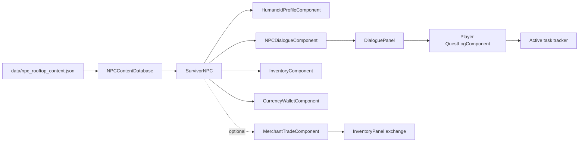

# Rooftop Survivors: NPC, Dialogue, Trade, and Quest System

## Player experience

Ten survivors occupy Ashdown's safe rooftops. Approach one and press **E** to
open a bottom-screen conversation panel. The header identifies the speaker and
shows their relationship toward the player. Responses use a consistent RPG
language:

- green **Supportive** responses usually improve the relationship;
- gold **Pragmatic** responses seek information or make a neutral decision;
- red **Confrontational** responses usually damage the relationship.

Relationship ranges from 0 to 100 and begins at 50. A survivor's opening line
changes below 35 and at 70 or higher. Story commentary selects the highest phase
whose `min` value is no greater than current story progress. In this iteration,
story progress is the number of completed quests.

Some dialogue offers a task. Accepted tasks appear in the compact HUD tracker.
Returning with the required inventory item, meeting count, or mist-creature kill
count reveals a turn-in response. Completion consumes requested delivery items,
pays Breach Scrip, improves the giver's relationship, and advances story
progress. A discussion topic changes relationship only the first time it is
chosen, preventing repeat farming.

Five survivors can trade. Choosing the trade response closes conversation and
opens the existing two-backpack exchange: the player's real backpack on one
side and that NPC's persistent backpack on the other. Prices, scrip, item state,
capacity, and drag/click behavior remain in the shared container and trade
components.

## First roster

| NPC | Character | Capability / task |
| --- | --- | --- |
| Imani Okafor | cautious adult quartermaster | trade, Emergency Power |
| Dr. Lena Park | empathetic middle-aged physician | trade, The Roof Clinic |
| Mateo Ruiz | quick, defensive young courier | Thin the Mist |
| Grace Holloway | elderly librarian and oral historian | Voices on the Roofs |
| Jun Chen | skeptical teenage radio hobbyist | electronics trade |
| Nia Brooks | observant child rooftop scout | Supper for Two |
| Tomas Varga | blunt elderly superintendent | trade, One More Crossing |
| Asha Singh | guilty young portal researcher | breach exposition |
| Malik Reed | responsible adult fire captain | trade, Signal Fire |
| Evelyn Ward | politically minded middle-aged organizer | settlement exposition |

The roster deliberately includes children, teenagers, young adults, adults,
middle-aged people, and elders. Children provide information and delivery tasks;
they are not combat targets or combat quest givers.

## Architecture



- `SurvivorNPC.gd` is the composition root and world interaction actor. It has
  no player input or quest rules.
- `NPCDialogueComponent.gd` selects relationship/progress text and exposes
  choices. It does not draw UI.
- `QuestLogComponent.gd` owns per-character states, event counts, people met,
  objective checks, item consumption, and rewards.
- `DialoguePanel.gd` renders conversations and applies chosen actions. It hands
  trade to `InventoryPanel`.
- `NPCContentDatabase.gd` loads the human-readable JSON table. Each NPC record
  defines identity, traits, roof position, appearance, stock, quest link, and
  dialogue. Quest rows define objectives and rewards.

## Extending the system

Add an NPC by adding one JSON row with a unique `id`, safe rooftop `position`,
identity fields, three relationship greetings, progress lines, and topics. Set
`can_trade` and `stock` only when the character is a merchant. Add the row's
actor to another scene/layer by reusing `SurvivorNPC.setup()`; none of the
conversation logic depends on rooftops.

Add a quest row and reference its ID from an NPC. Supported objective types are
`item`, `event`, and `meet_npcs`. New objective types belong in
`QuestLogComponent._objective_ready()` and `objective_summary()`. World systems
record progress through `record_event()`; the current mist enemies record
`mist_kill` on death.

The content loader can be reloaded without changing runtime classes. Future save
data should serialize quest `states`, `event_counts`, `met_characters`, dialogue
`used_topic_ids`, and both humanoid relationship maps by stable character ID.

## Validation

Run:

```powershell
rtk proxy cmd.exe /d /c "set APPDATA=D:\workspace\AIGodot\.godot_local\appdata&& set LOCALAPPDATA=D:\workspace\AIGodot\.godot_local\localappdata&& D:\workspace\GodotRuntime\Godot_v4.6.2-stable_win64_console.exe --headless --path . --script tests/npc_dialogue_quest_smoke.gd"
```

The smoke test covers roster variety, stable IDs, optional trade composition,
relationship and progress text, response tones, non-repeatable social effects,
quest acceptance/completion/reward, two-backpack trade handoff, and E-routing.
